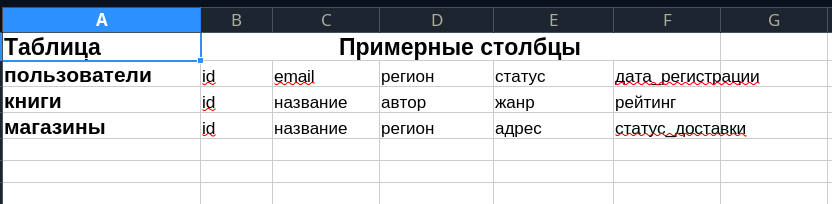
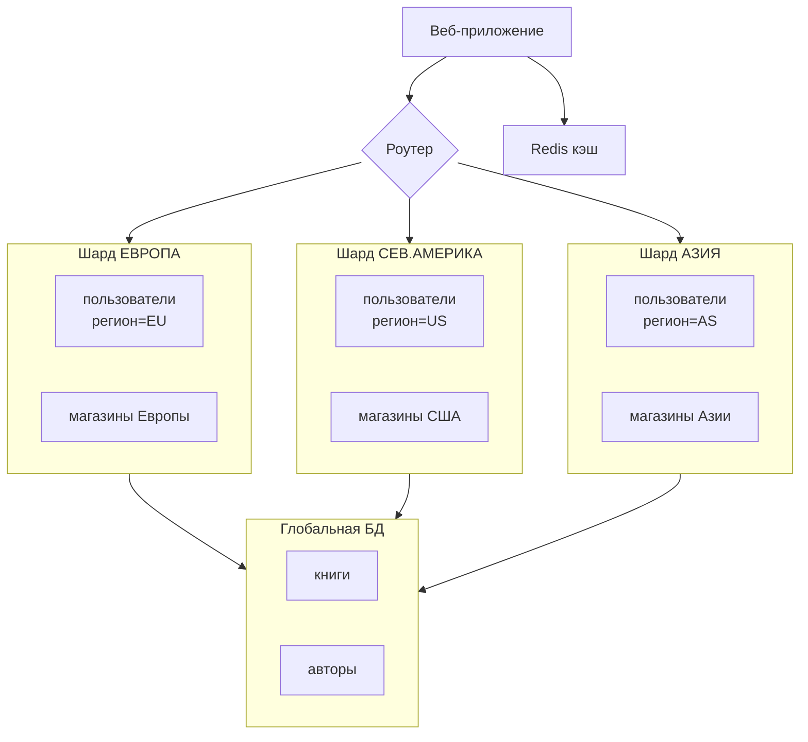

# Домашнее задание: Репликация и масштабирование. Часть 2 - Шаров Олег

## Задание 1

Описание основных преимуществ методов масштабирования:

### 1. Активный master-сервер и пассивный репликационный slave-сервер

**Преимущества:**
- Простота реализации и настройки
- Надёжность: при отказе master можно вручную (или автоматически через скрипты) перевести роль на slave
- Резервное копирование без нагрузки на основной сервер (бэкапы делаются со slave)
- Низкие требования к сетевой инфраструктуре
- Минимальный риск потери данных при синхронной репликации

**Типичный сценарий:** системы с умеренной нагрузкой, где важна отказоустойчивость, но не требуется высокая автоматизация переключения.

---

### 2. Master-сервер и несколько slave-серверов

**Преимущества:**
- Горизонтальное масштабирование чтения: запросы SELECT распределяются между slave-серверами
- Снижение нагрузки на master: он обрабатывает только запись (INSERT/UPDATE/DELETE)
- Возможность размещения slave в разных географических локациях для снижения latency
- Гибкость: часть slave можно использовать для бэкапов, часть — для аналитики, часть — для обслуживания пользователей
- Повышение общей доступности системы

**Типичный сценарий:** веб-приложения с преобладанием чтения (соцсети, новостные сайты, интернет-магазины).

---

### 3. Активный сервер с DRBD (Distributed Replicated Block Device)

**Преимущества:**
- Репликация на уровне блочного устройства (диска), а не приложения — прозрачна для СУБД
- Синхронная репликация в реальном времени: минимальный RPO (Recovery Point Objective)
- Быстрое переключение (обычно секунды): при отказе основного узла резервный мгновенно получает доступ к данным
- Не требует изменений в приложении или СУБД
- Подходит для stateful-сервисов, где сложно реализовать репликацию на уровне приложения (например, PostgreSQL без логической репликации)

**Ограничения:** работает только в паре «активный/пассивный», требует стабильного сетевого соединения между узлами.

**Типичный сценарий:** критически важные системы с требованиями к RTO < 1 минуты (финансовые системы, корпоративные БД).

---

### 4. SAN-кластер (Storage Area Network)

**Преимущества:**
- Централизованное хранилище данных, доступное всем узлам кластера одновременно
- Мгновенное переключение между узлами: при отказе узла другой берёт на себя его задачи без копирования данных
- Высокая производительность за счёт выделенной высокоскоростной сети (Fibre Channel, iSCSI)
- Упрощённое управление хранилищем: резервное копирование, снапшоты, репликация реализуются на уровне хранилища
- Масштабируемость хранилища независимо от вычислительных узлов

**Типичный сценарий:** enterprise-среды с кластеризованными СУБД (Oracle RAC, Microsoft SQL Server Failover Cluster), виртуализация (VMware vSphere).

---

## Вывод

Выбор архитектуры зависит от:
- Требований к доступности (RTO/RPO)
- Соотношения операций чтения/записи
- Бюджета (SAN требует дорогостоящего оборудования)
- Сложности администрирования
- Географического распределения пользователей

## Задание 2. План горизонтального и вертикального шардинга

> **Примечание:** В задании имеется в виду **шардинг** (sharding) — разделение данных между серверами, а не «шаринг».

### Исходные данные

База данных содержит 3 таблицы:

### Принципы разделения

| Таблица      | Тип шардинга       | Ключ разделения | Обоснование                                                                 |
|--------------|--------------------|-----------------|-----------------------------------------------------------------------------|
| `пользователи` | Горизонтальный     | `регион`        | Пользователи взаимодействуют преимущественно внутри своего географического региона |
| `магазины`    | Горизонтальный     | `регион`        | Магазины обслуживают локальные заказы, доставка ограничена регионом         |
| `книги`       | Вертикальный       | —               | Каталог книг одинаков для всех регионов → хранится как единая общая таблица |

---

Шаг 5: Альтернатива — диаграмма в формате Mermaid

